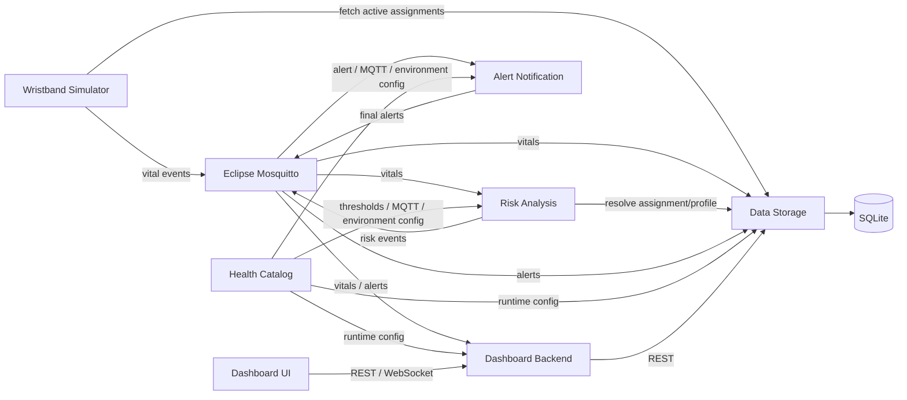
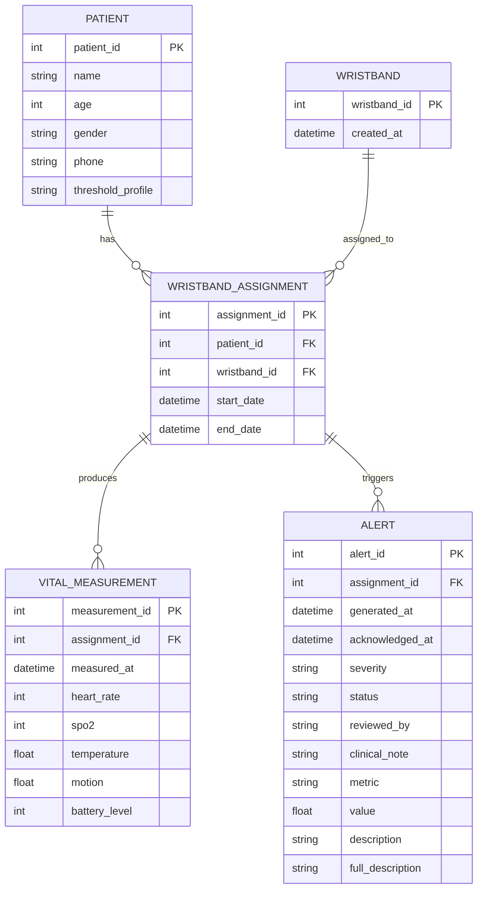

# IoT Health Monitoring Platform

A containerized, event-driven IoT health monitoring platform for collecting wearable vital signs, applying profile-specific risk rules, persisting clinical events, and exposing dashboard-oriented APIs.

Originally developed as a course project, this repository has since been hardened with reproducible database initialization, assignment-integrity constraints, regression tests, runtime configuration, and end-to-end verification of the MQTT alert pipeline.

## Architecture

The platform is composed of independent Python services connected through REST and MQTT.



## Runtime Services

| Service | Role | Host Port |
| --- | --- | ---: |
| Dashboard Backend | REST/WebSocket API for dashboard clients | `8000` |
| Health Catalog | Runtime configuration and threshold profiles | `8001` |
| Data Storage | Persistence and domain logic | `8003` |
| MQTT Broker | Eclipse Mosquitto event transport | `1883` |
| Risk Analysis | Profile-based vital evaluation | internal |
| Alert Notification | Risk-event to alert transformation | internal |
| Wristband Simulator | Local telemetry generator | internal |

## End-to-End Flow

1. Wristband Simulator retrieves active assignments from Data Storage.
2. Vitals are published to `wristbands/{wristband_id}/vitals`.
3. Data Storage resolves the active assignment and persists the measurement.
4. Risk Analysis receives the same event and resolves the patient's threshold profile.
5. Profile-specific thresholds from Health Catalog are evaluated.
6. Warning or critical breaches become risk events.
7. Alert Notification converts risk events into final alert payloads.
8. Data Storage resolves the wristband back to its active assignment and persists the alert.
9. Dashboard Backend exposes persisted and live information to clients.

The complete pipeline has been verified with a controlled Docker E2E test using a `CARDIAC` profile and a critical heart-rate event.

## Core Services

### Dashboard Backend

FastAPI orchestration layer for dashboard clients.

Main route groups:

- `/patients`
- `/vitals`
- `/alerts`
- `/dashboard`
- `/wristbands`
- `/ws`

It retrieves persisted domain data from Data Storage and subscribes to MQTT vital and alert streams for real-time delivery.

### Data Storage

FastAPI + SQLAlchemy service responsible for persistence and domain consistency.

REST endpoints are exposed under `/api/v1`.

Responsibilities include:

- patient management
- wristband management
- active assignment resolution
- vital measurement persistence
- alert persistence and lifecycle updates
- dashboard aggregation
- database initialization
- deterministic demo seeding
- assignment-integrity enforcement

The current runtime database is SQLite at `data/health.db`.

The runtime database is generated locally and is not treated as version-controlled application state.

### Health Catalog

Central configuration service for:

- threshold profiles
- MQTT topics
- alert configuration
- runtime environments
- service registry information

Important configuration endpoints include:

- `/config/thresholds/`
- `/config/mqtt/topics`
- `/config/alerts/`
- `/config/environments/`
- `/registry/services/`

Threshold profiles currently include:

- `STANDARD`
- `CARDIAC`
- `ELDERLY`
- `RESPIRATORY_RISK`
- `HIGH_RISK`

### Risk Analysis

Consumes wearable vital events and evaluates them against the threshold profile associated with the active wristband assignment.

Supported threshold dimensions include:

- heart rate
- SpO2
- temperature
- battery level

The telemetry contract uses fields such as `heart_rate` and `battery_level`, while Health Catalog uses canonical threshold keys such as `hr` and `battery`. Risk Analysis maps these contracts before evaluation.

### Alert Notification

Consumes risk events and produces final alert payloads containing:

- severity
- lifecycle status
- threshold profile
- breached metric
- measured value
- generated timestamp
- human-readable descriptions

Final alerts are published through MQTT and persisted by Data Storage.

### Wristband Simulator

Simulates wearable devices for active assignments.

Generated telemetry includes:

- heart rate
- SpO2
- temperature
- motion
- battery level
- measurement timestamp

## Domain Model



The assignment entity is central to the model: measurements and alerts belong to the patient-device assignment active at the time of the event.

## Integrity and Reliability

The backend includes:

- database-level uniqueness for active patient and wristband assignments
- application-level assignment validation
- atomic patient creation and initial wristband assignment
- HTTP conflict handling for duplicate wristbands
- active-assignment resolution before storing vitals or alerts
- schema initialization for existing SQLite databases
- deterministic demo seed data for empty databases
- profile-specific health thresholds
- timezone-aware UTC event timestamps
- persisted creation timestamps returned from the database
- environment-configurable internal service URLs
- health-aware Docker Compose dependencies
- regression coverage for previously identified defects

## Quick Start

### Requirements

- Docker
- Docker Compose

The service images use Python 3.11.

### Start the platform

From the repository root:

```bash
docker compose -f deployment/docker-compose.yml up -d --build
```

Check service state:

```bash
docker compose -f deployment/docker-compose.yml ps
```

Primary local endpoints:

- Dashboard Backend: `http://localhost:8000`
- Health Catalog: `http://localhost:8001`
- Data Storage: `http://localhost:8003`
- MQTT Broker: `localhost:1883`

FastAPI interactive documentation:

- `http://localhost:8000/docs`
- `http://localhost:8001/docs`
- `http://localhost:8003/docs`

Stop the platform with:

```bash
docker compose -f deployment/docker-compose.yml down
```

## Testing

The regression suite covers:

- active assignment integrity
- database schema upgrades
- MQTT callback compatibility
- timestamp handling
- dashboard aggregation
- patient and wristband API error propagation
- alert acknowledgement behavior
- service URL configuration
- deterministic database seeding
- risk-analysis metric mapping

Run the full test suite with:

```bash
pytest -q
```

A controlled Docker E2E scenario has also verified:

```text
Wristband MQTT event
    -> Data Storage persistence
    -> Risk Analysis
    -> Alert Notification
    -> MQTT alert
    -> assignment resolution
    -> alert persistence
```

## Repository Structure

```text
.
├── DataBase/                     # Original ER/database design assets
├── dashboard-ui/                 # Compiled frontend artifact
├── deployment/
│   ├── docker-compose.yml
│   └── mqtt-broker/
├── services/
│   ├── alert_notification/
│   ├── dashboard-backend/
│   ├── data-storage/
│   ├── health-catalog/
│   ├── risk_analysis/
│   └── wristband-simulator/
├── tests/                        # Backend regression tests
└── README.md
```

## Technology Stack

- Python 3.11
- FastAPI
- SQLAlchemy
- Pydantic
- Uvicorn
- Eclipse Mosquitto
- Paho MQTT
- SQLite
- Docker
- Docker Compose
- Pytest

## Project Scope

This repository is currently focused on the backend and distributed-system architecture.

The original course-project snapshot contains compiled dashboard assets under `dashboard-ui/dist`, but the maintainable frontend source is not present in the available repository history. Current development therefore focuses on backend architecture, domain integrity, MQTT event flow, persistence, APIs, testing, and reproducibility.

## Current Status

The backend has completed a focused forensic audit and controlled end-to-end integration verification.

Current portfolio work focuses on:

- automated CI for the regression suite
- repository and documentation polish
- final reproducibility and release audit
